# Linkeds
Low level python messenger with async cleint-server

My new version of my old project(that was also based on my old project)

In my last project processing time of requests was too big, so i decided to create new project with async based...
(This project is being done for my school individual project)

# How to INSTALL my child:
1) pip install pyqt6
2) pip install pymysql
3) To use database u need to install openserver and use my database_config.rar save
4) put it into corner of OpenServer to userdata\...
5) then start ur local database
6) pray to god
7) run runserver.py in SERVER\...
8) then in LinkedsMain\... run linkeds.py
9) pray to god
10) Complete!

thank if u really do this  

# Screenshots of GUI:
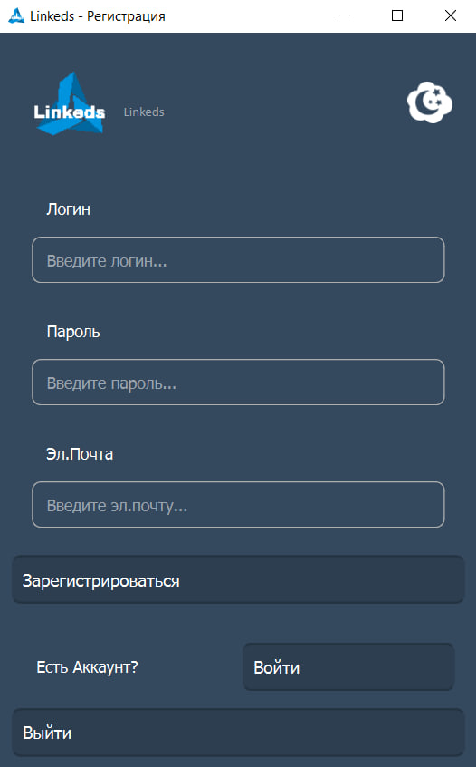
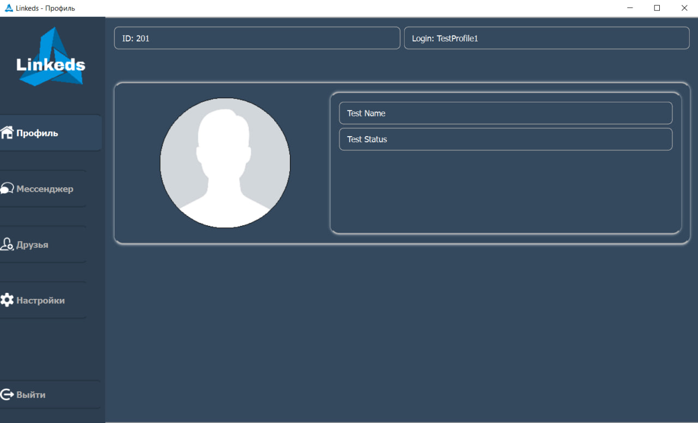
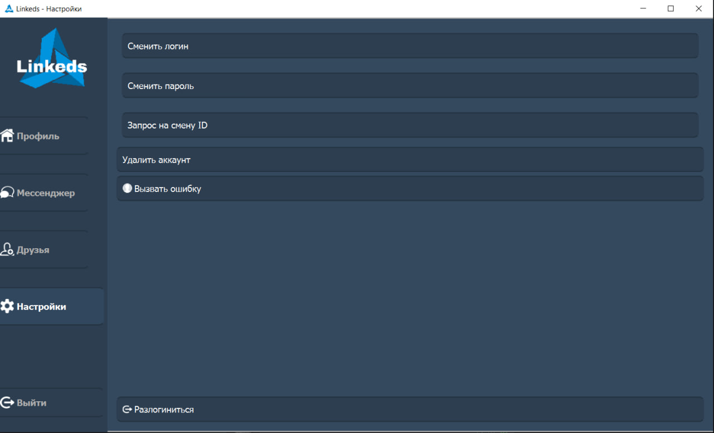
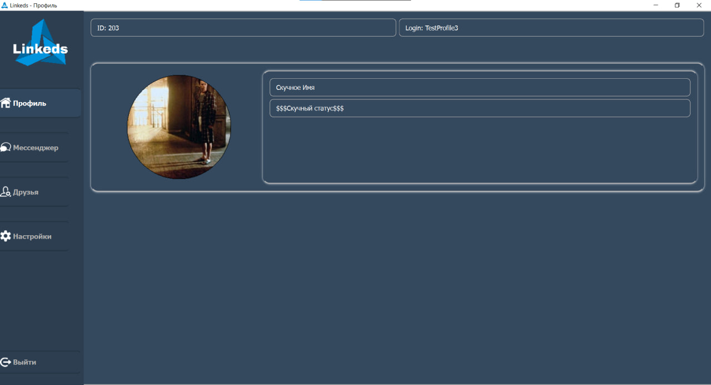
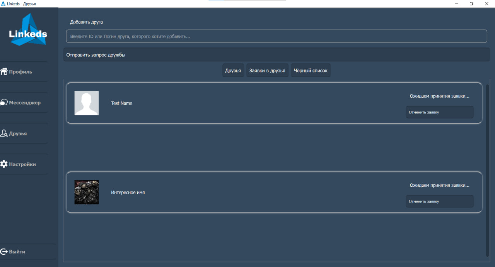
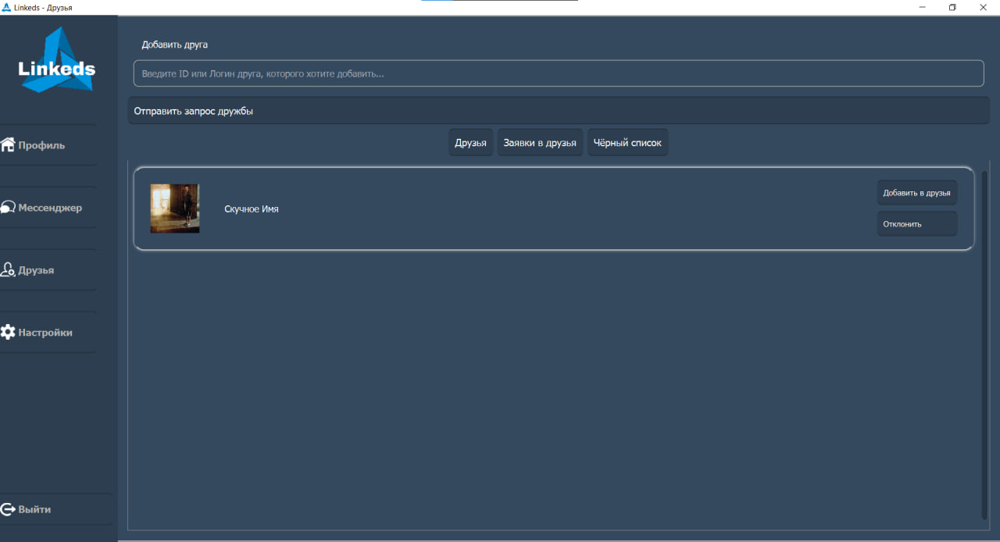
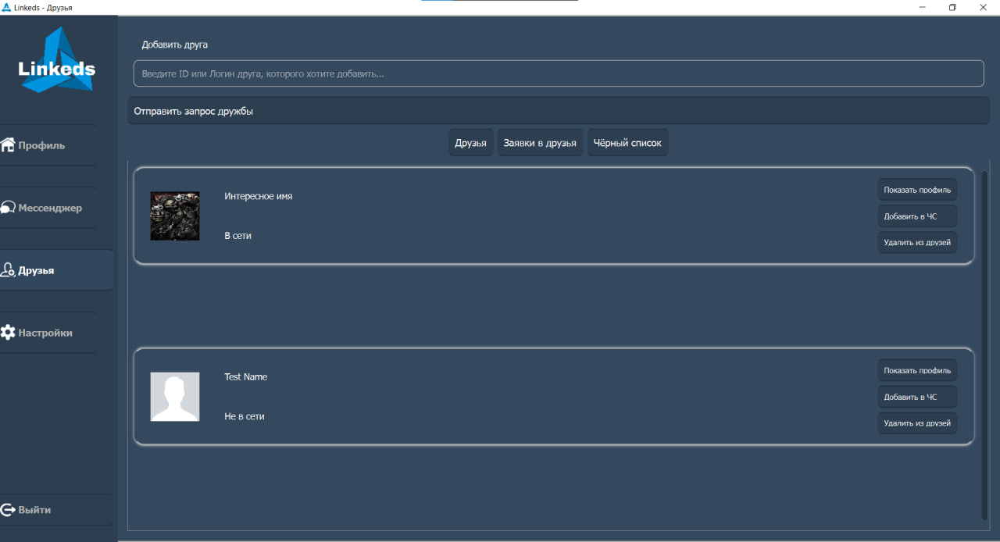

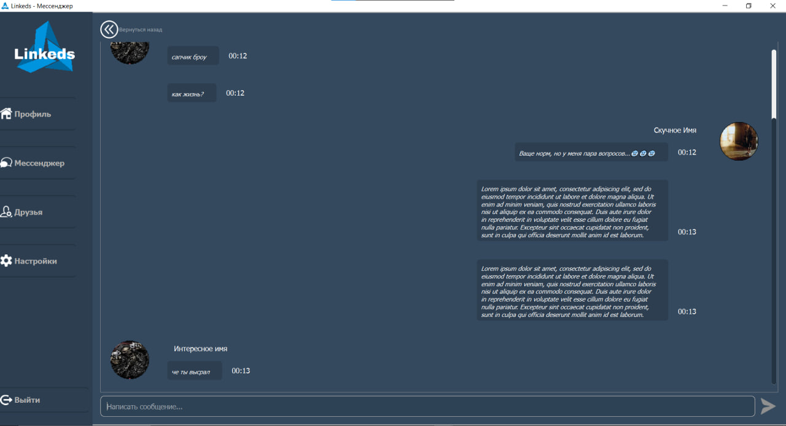
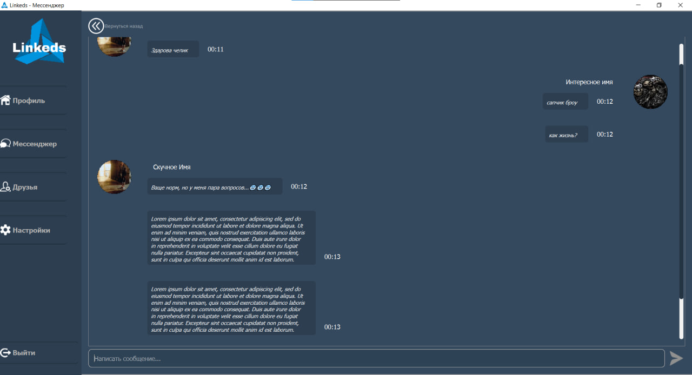

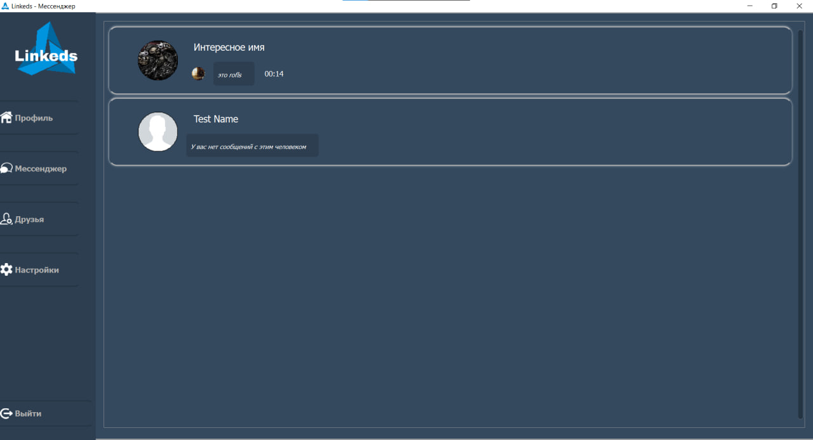
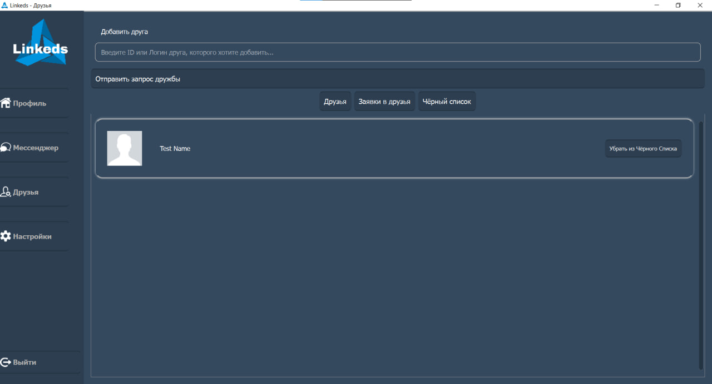
